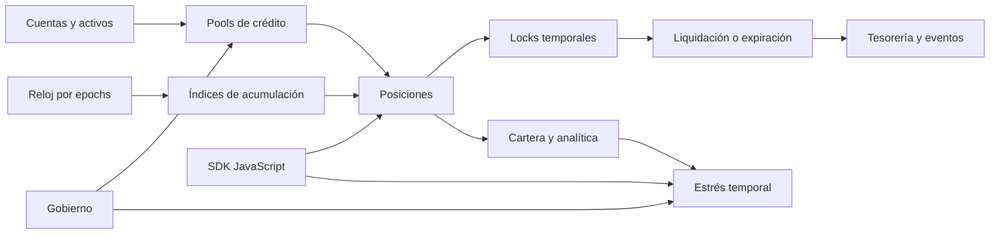
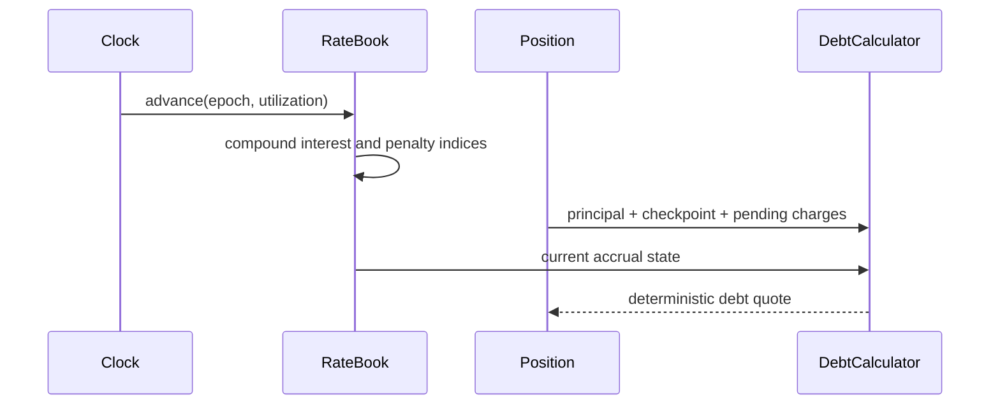
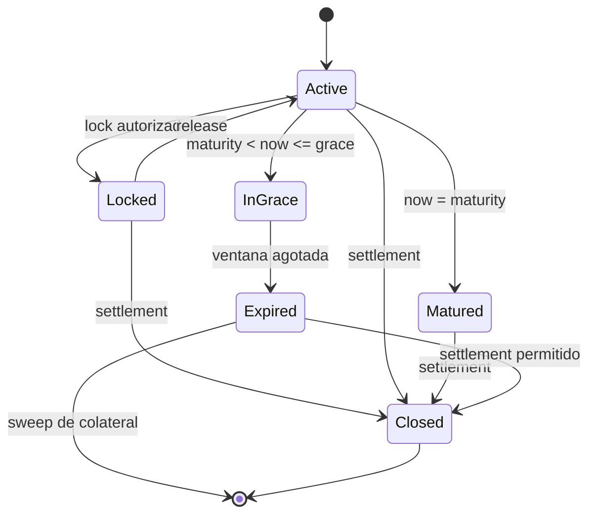
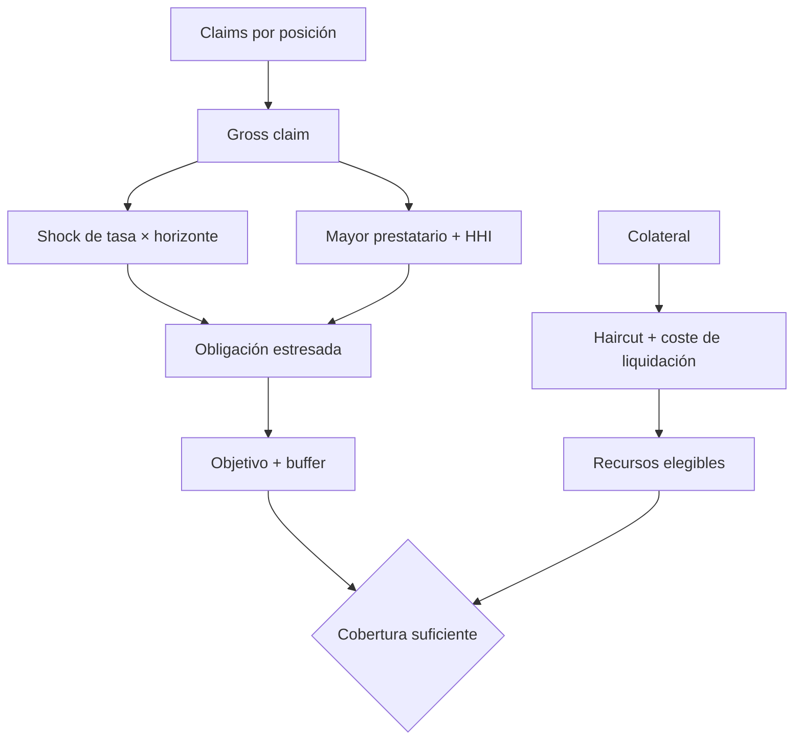

# ChronosDTL


[](https://github.com/SolguardLabs/ChronosDTL/actions/workflows/ci.yml)
[](https://github.com/SolguardLabs/ChronosDTL/releases/tag/v1.0.0)
[](https://www.rust-lang.org/)
[](https://nodejs.org/)

ChronosDTL es una infraestructura de crédito y liquidación temporal escrita en Rust. Modela pools, posiciones garantizadas, índices de acumulación, vencimientos efectivos, locks operativos, ventanas de repago, expiración y rutas de tesorería sobre epochs deterministas.

La versión `1.0.0` añade estrés de activos y pasivos por horizonte, concentración por prestatario, duración ponderada, gobierno con operaciones BLAKE3 y un SDK JavaScript que conserva importes de 128 bits. El crate no depende del reloj del host: toda decisión temporal recibe un epoch explícito y reproducible.

## Capacidades

- Cuentas multiactivo con saldos disponibles y retenidos.
- Pools con liquidez, principal vivo, colateral, reserva y límites de utilización.
- Curvas por epoch con índices de interés y penalización de precisión fija.
- Posiciones con maturity contractual, maturity efectivo y checkpoint de acumulación.
- Locks de repago, rollover, gracia, revisión operativa y retención de subasta.
- Cierre, expiración, absorción de colateral y conciliación de tesorería.
- Estrés temporal con haircut, coste de liquidación, shock de tasa y concentración.
- Gobierno con quórum, timelock, expiración, predecesores y guardián.
- SDK HTTP con TLS obligatorio, timeout, idempotencia y cantidades atómicas.

## Arquitectura



El ledger es la fachada de mutación. Las colecciones de dominio conservan estado, pero la apertura, el lock, el cierre y la expiración pasan por `ChronosLedger` para coordinar riesgo, saldos, pools e historial.

## Deuda temporal

Cada pool mantiene índices acumulativos. Para un principal `P`, índice actual `Iₜ` y checkpoint `I₀`:

```text
interest_delta = floor(P × (Iₜ - I₀) / 10¹²)
interest_due   = pending_interest + interest_delta
penalty_due    = pending_penalty + penalty_index_delta, si now > maturity
close_fee      = floor(P × close_fee_bps / 10_000)
total_due      = P + interest_due + penalty_due + close_fee
```



Las cantidades usan `u128`; los índices usan una escala de `10¹²`; las tasas se expresan en puntos básicos. Las sumas y multiplicaciones económicas devuelven error ante overflow.

## Ciclo de posición



Un lock conserva propietario, modo, operador opcional, epoch de creación, release, referencia y snapshot de la posición. El maturity efectivo y el checkpoint activo forman parte del estado de la posición.

## Estrés económico

Para una cartera de un pool:

```text
claim = principal + quoted_interest + quoted_penalty
eligible_collateral = floor(collateral × (10_000 - haircut - liquidation_cost) / 10_000)
projected_interest = ceil(gross_claim × rate_shock_per_epoch × horizon / 10_000)
concentration_addon = ceil(largest_borrower_claim × concentration_bps / 10_000)
required = ceil((gross_claim + projected_interest + concentration_addon)
                × target_coverage_bps / 10_000) + operational_buffer
```



El informe incluye déficit por pool, cobertura, HHI, participación del mayor prestatario y maturity ponderado. Un excedente en otro pool no oculta un déficit local.

## Gobierno

Las operaciones usan un envelope canónico y BLAKE3. La identidad liga protocolo, red, cadena, target, selector, digest del payload, predecesor, salt, `eta`, expiración y quórum.

```text
executable = approvals >= quorum
          && now >= eta
          && now < expires_at
          && predecessor_satisfied
          && status == scheduled
```

El guardián puede cancelar una operación programada, pero no aprobarla ni ejecutarla fuera de ventana.

## Inicio rápido

Requisitos:

- Rust `1.96.0` con `rustfmt` y `clippy`.
- Node.js 24 para contratos de integración y SDK.

```bash
npm ci
cargo build --all-targets --locked
cargo test --all-targets --locked
npm test
```

Validación completa:

```bash
npm run ci
```

## SDK JavaScript

```js
const { ChronosClient, computeTemporalStress } = require("./sdk/chronosClient");

const client = new ChronosClient({
  baseUrl: "https://chronos.example",
  token: process.env.CHRONOS_TOKEN,
  timeoutMs: 5_000,
});

const quote = await client.quotePosition("pos-42", 128n);
```

Los importes aceptan `bigint`, entero seguro o string decimal canónico. El transporte convierte `bigint` en strings, exige JSON, rechaza redirecciones y aplica claves de idempotencia a escrituras.

## Estructura

```text
.
├── assets/                 Identidad visual
├── docs/                   Diseño y operación
├── sdk/                    Cliente y cálculo offline
├── scripts/                CI y controles del repositorio
├── src/                    Dominios Rust
└── tests/                  Flujos, controles y contratos Node
```

## Documentación

| Documento                                     | Contenido                                   |
| --------------------------------------------- | ------------------------------------------- |
| [Arquitectura](docs/architecture.md)          | Límites, módulos, estado y determinismo     |
| [Deuda y epochs](docs/debt-and-epochs.md)     | Índices, checkpoints, maturity y redondeo   |
| [Modelo económico](docs/economic-model.md)    | Estrés, cobertura, HHI y duración           |
| [Gobierno](docs/governance.md)                | BLAKE3, quórum, timelock y predecesores     |
| [Modelo de seguridad](docs/security-model.md) | Activos, confianza, controles e invariantes |
| [Operaciones](docs/operations.md)             | Promoción, observabilidad y recuperación    |
| [SDK](docs/sdk.md)                            | Transporte, tipos, errores y ejemplos       |

## Entrega

La CI compila, formatea, prueba y ejecuta Clippy en Ubuntu y Windows. La rama `production`, `main` y el tag anotado `v1.0.0` deben resolver al mismo commit antes de publicar `Production 1.0.0`.

## Seguridad

Consulte [SECURITY.md](SECURITY.md) para versiones cubiertas, reporte privado y respuesta operativa.

## Licencia

Consulte [LICENSE](LICENSE).
