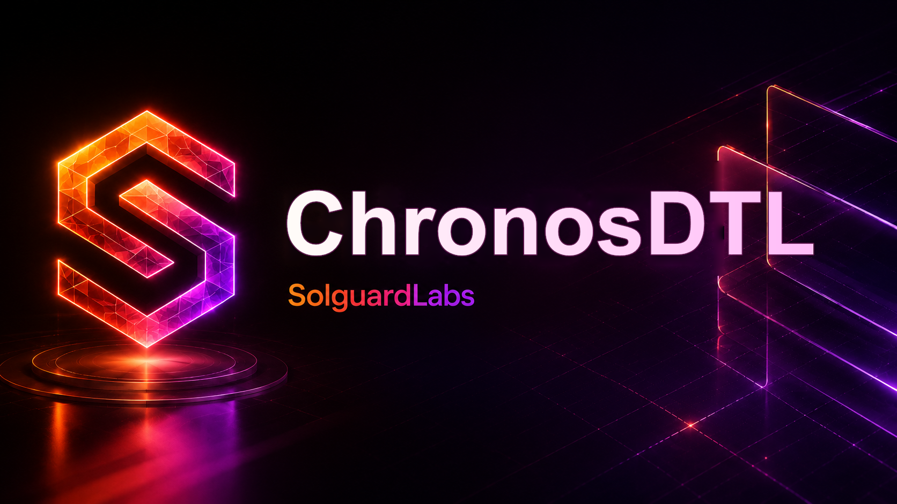

# ChronosDTL



ChronosDTL es una libreria Rust para liquidaciones dependientes del tiempo. El
modelo combina epochs, vencimientos efectivos, intereses acumulados, locks
temporales, cierre de posiciones y expiracion con barrido de colateral.

## Componentes

- `ledger`: API principal para cuentas, activos, pools, posiciones y locks.
- `rates`: indices de acumulacion por pool y epoch.
- `debt`: cotizacion de principal, intereses, penalizaciones y cargos de cierre.
- `position`: estado de posiciones y checkpoints de acumulacion.
- `locks`: ventanas temporales de rollover, repago y revision operativa.
- `expiry`: politica de expiracion y absorcion de colateral.
- `analytics`, `portfolio`, `audit`: vistas de riesgo y reportes de revision.

## Requisitos

- Rust 1.96 o superior.
- Node.js 22 o superior.
- Bash para ejecutar los scripts de CI local.

## Uso

```bash
cargo test --locked
node --test "tests/node/*.test.js"
```

Tambien puede ejecutarse la validacion completa:

```bash
bash scripts/ci.sh
```

## Estructura

```text
src/
  accounts/      balances, holds y snapshots
  amount/        cantidades, bps e indices fijos
  ledger/        orquestacion del protocolo
  locks/         locks temporales y snapshots
  rates/         curvas e indices de acumulacion
  settlement/    requests y receipts de cierre
  expiry/        decisiones de expiracion
  analytics/     metricas por epoch
tests/
  chronos_flow.rs
  node/
scripts/
  ci.sh
  tests.sh
```

## Estado

El proyecto esta preparado como crate de libreria. Los tests cubren flujos
representativos de deposito, liquidez, apertura de posicion, lock temporal,
cierre normal y expiracion.
