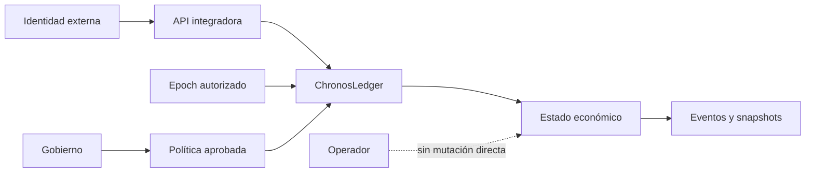

# Política de seguridad

ChronosDTL coordina deuda, colateral, tiempo y autorización. La integridad económica depende de que el mismo estado temporal sea visible en cotización, lock, cierre, expiración y conciliación.

## Versiones cubiertas

| Versión   | Estado           | Cobertura             |
| --------- | ---------------- | --------------------- |
| `1.0.x`   | Activa           | Correcciones y avisos |
| `< 1.0.0` | Fuera de soporte | Migración requerida   |

La referencia estable es el release más reciente publicado desde `production`.

## Reporte privado

Use **GitHub → Security → Advisories → New draft security advisory**. No incluya detalles sensibles en issues, discusiones o pull requests.

Adjunte:

- versión, commit, plataforma y toolchain;
- módulo y precondiciones;
- secuencia mínima con epochs explícitos;
- estado previo, transición y estado posterior;
- diferencia entre deuda esperada y observada;
- impacto sobre pool, prestatario, tesorería o colateral;
- comprobación de regresión propuesta;
- registros sin secretos ni datos personales.

## Tiempos objetivo

| Fase                        |           Objetivo |
| --------------------------- | -----------------: |
| Acuse                       |  2 días laborables |
| Clasificación               |  5 días laborables |
| Plan de corrección          | 10 días laborables |
| Coordinación de publicación |      Según impacto |

## Límites de confianza

- La autenticación pertenece a la integración.
- El epoch debe proceder de una fuente acordada y quedar en la evidencia.
- Las mutaciones económicas pasan por el ledger.
- Los parámetros de riesgo se cambian mediante una operación identificada.
- El SDK exige HTTPS fuera de localhost y no sigue redirecciones.
- Las claves, firmas y aprobaciones persistentes se custodian fuera del crate.

## Activos protegidos

- Liquidez y reserva de cada pool.
- Principal vivo y colateral retenido.
- Índices y checkpoints de acumulación.
- Interés y penalización pendientes.
- Maturity contractual y efectivo.
- Estado, snapshot y ventana de cada lock.
- Quórum, payload y precedencias de gobierno.
- Secuencia de eventos y artefactos de release.

## Invariantes

- Ninguna posición se abre con maturity anterior o igual al epoch actual.
- Ningún pool presta por encima de su liquidez disponible.
- El colateral permanece retenido hasta cierre, cancelación o expiración válida.
- Toda cotización usa el índice del pool asociado a la posición.
- Las cantidades y los índices devuelven error ante overflow.
- Un cambio de campo en gobierno produce una identidad distinta.
- Una operación vencida, cancelada o sin quórum no es ejecutable.
- Un déficit de pool no se compensa implícitamente con otro pool.
- El release estable alinea `main`, `production` y el tag anotado.

## Cadena de suministro

- `Cargo.lock` y `package-lock.json` versionados.
- Rust fijado a `1.96.0` en CI.
- `cargo fmt`, build, tests y Clippy con warnings como error.
- Contratos Node y formato Prettier.
- Dependabot para Cargo, npm y GitHub Actions.
- CI sin secretos para compilar o probar.
- Material privado, `target`, `node_modules` y outputs fuera de Git.

## Respuesta

1. Detener aperturas y nuevos locks del pool afectado.
2. Preservar epoch, snapshot, eventos, operación y hash del binario.
3. Cotizar posiciones sin ejecutar cierres automáticos.
4. Conciliar principal, índices, pending charges y colateral por posición.
5. Ejecutar estrés temporal con los parámetros vigentes.
6. Preparar una política temporal con expiración y aprobación independiente.
7. Validar la recuperación en una copia de estado.
8. Publicar un release alineado antes de reanudar.

Consulte [docs/security-model.md](docs/security-model.md) y [docs/operations.md](docs/operations.md).
