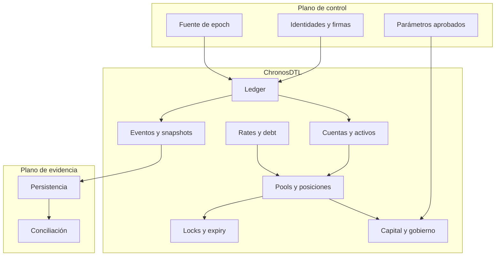
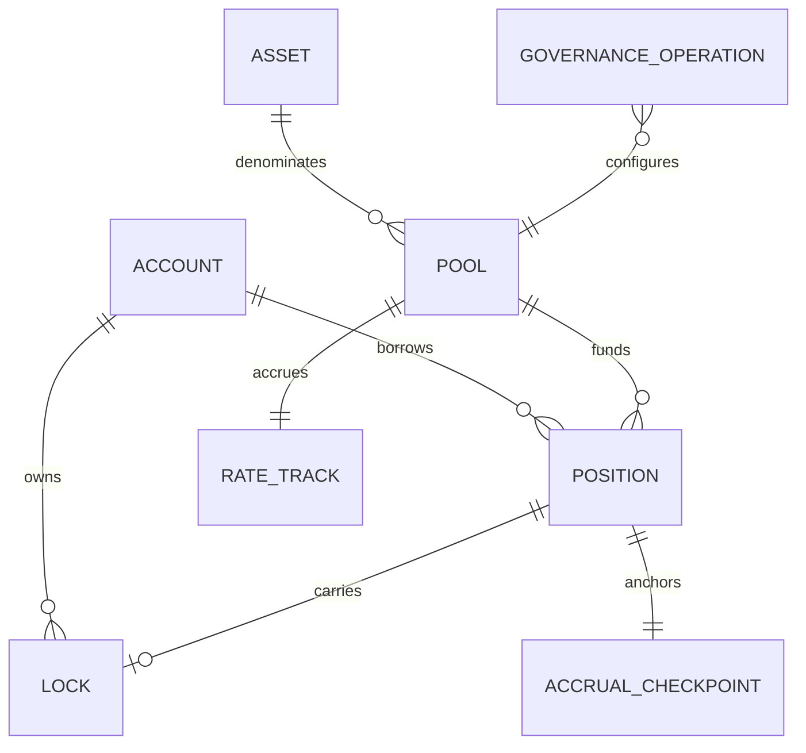

# Arquitectura

## Objetivo

ChronosDTL ofrece un modelo determinista para crédito garantizado cuyo estado cambia por epochs. El crate separa almacenamiento, cálculo, política y orquestación para que cada transición pueda revisarse y reproducirse sin red ni reloj implícito.

## Límites

Autenticación, firma, persistencia y consenso sobre el epoch pertenecen a la integración. El crate valida consistencia, aplica aritmética y devuelve estructuras serializables.

## Dominios

| Dominio      | Responsabilidad                                          |
| ------------ | -------------------------------------------------------- |
| `amount`     | `u128`, puntos básicos e índices de precisión fija       |
| `accounts`   | disponible, retenido y snapshots por activo              |
| `asset`      | configuración, decimales, estado y receptor de fees      |
| `pools`      | liquidez, principal, colateral, reserva y utilización    |
| `rates`      | curvas, muestras e índices por epoch                     |
| `position`   | términos, maturity, checkpoint, pending charges y estado |
| `debt`       | clasificación y cotización de cierre                     |
| `locks`      | modos, snapshots, release y estado                       |
| `expiry`     | gracia, sweep y absorción de colateral                   |
| `risk`       | límites de apertura, lock y cierre                       |
| `capital`    | estrés temporal y cobertura por pool                     |
| `governance` | identidad BLAKE3, quórum y ciclo de operación            |
| `events`     | journal ordenado de transiciones                         |

## Grafo económico

Los IDs son tipos nominales sobre `u64`; no se intercambian accidentalmente entre cuenta, pool, posición o lock. Las colecciones internas validan duplicados y referencias.

## Mutación

`ChronosLedger` coordina una operación completa:

1. resuelve referencias;
2. consulta riesgo;
3. cotiza con el índice actual;
4. modifica cuentas, pool y posición;
5. actualiza lock o expiry cuando aplica;
6. emite un evento con tx y epoch.

Los módulos analíticos, de cartera y capital reciben vistas y no mutan el ledger.

## Determinismo

Una ejecución depende solo de:

- estado inicial serializado;
- secuencia de llamadas;
- epochs y segundos explícitos;
- parámetros del ledger;
- versión del crate.

No se usa aleatoriedad, red, hora local ni coma flotante. `BTreeSet` ordena aprobaciones; los envelopes canónicos ordenan campos antes de aplicar BLAKE3; las salidas de cartera se ordenan por IDs.

## Serialización

Serde cubre entidades públicas. Los importes se serializan como valores `u128` en Rust; una API debe representarlos como strings decimales para clientes JavaScript. Los digests son 32 bytes y se intercambian en hexadecimal de 64 caracteres.

## Extensión

Un campo económico nuevo debe declarar unidad, rango, dirección de redondeo, estado propietario, transición autorizada, evento y compatibilidad de serialización. Todo cálculo dependiente del tiempo debe recibir `Epoch`; no debe consultar un reloj dentro del dominio.
