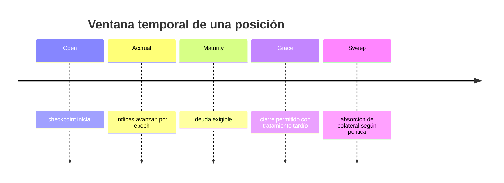
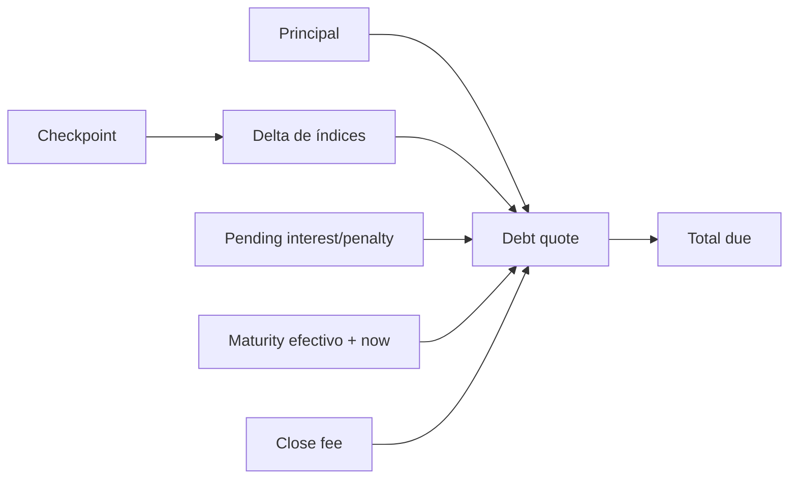

# Deuda y epochs

## Reloj

`EpochClock` mantiene epoch actual, segundos dentro del epoch y número de fronteras cruzadas. La política define duración, cutoff, gracia de locks, extensión máxima y retraso de sweep.



`advance_seconds` devuelve los epochs cruzados. `advance_epochs` avanza fronteras completas y reinicia los segundos internos a cero.

## Índices

La escala es:

```text
INDEX_SCALE = 1_000_000_000_000
```

Para tasa `r` en puntos básicos:

```text
index_next = index + floor(index × r / 10_000)
```

El índice de interés usa la curva del pool; el índice de penalización usa la tasa tardía. Cada posición conserva ambos valores en su checkpoint.

## Curva

```text
rate_bps = min(base_bps + utilization_bps × slope_bps / 10_000, max_bps)
```

La utilización se calcula sobre `liquidity_available + principal_outstanding`. Cada avance registra epoch, índices, utilización y tasa aplicada.

## Cotización



El estado informativo se clasifica así:

| Condición                   | Estado cotizado |
| --------------------------- | --------------- |
| `now < effective_maturity`  | Active          |
| `now == effective_maturity` | Matured         |
| dentro de gracia            | InGrace         |
| después de gracia           | Expired         |
| posición con lock           | Locked          |

## Materialización

Materializar mueve el delta observado a `pending_interest` y `pending_penalty`, y reemplaza el checkpoint. Esta operación separa deuda ya reconocida de acumulación futura.

Un snapshot de lock contiene estado, maturity, checkpoint, versión y cargos cotizados. La integración debe conservar ese snapshot junto con el evento de lock.

## Redondeo

- El interés por índice redondea hacia abajo en unidad atómica.
- Los fees ordinarios por puntos básicos redondean hacia abajo.
- El estrés prudencial usa `ceil` para obligaciones y `floor` para recursos.
- Nunca se usa coma flotante.

## Ejemplo

Con principal `1.000.000.000`, índice inicial `1.000.000.000.000` e índice actual `1.040.707.043.000`:

```text
interest = floor(1_000_000_000 × 40_707_043_000 / 1_000_000_000_000)
         = 40_707_043
```

La cotización también añade pending charges, penalización aplicable y fee de cierre.

## Evidencia de cierre

Un receipt incluye tx, posición, payer, pool, activo, estado previo, quote, pagado, colateral liberado y lock liberado. El consumidor debe comparar el quote autorizado con el receipt efectivo y registrar el epoch de ambos.
