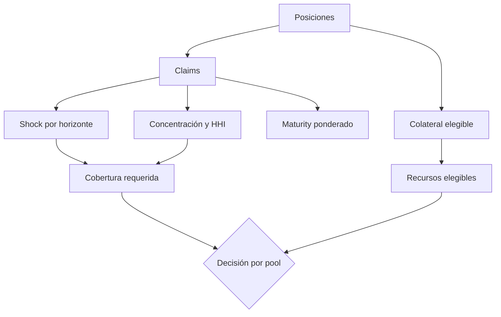
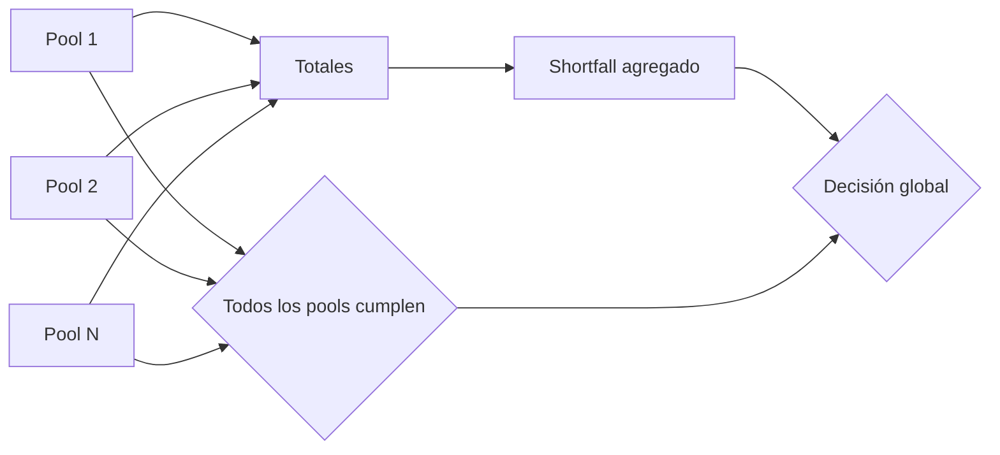

# Modelo económico

## Objetivo

El estrés temporal estima si cada pool puede cubrir claims bajo deterioro de colateral, coste de liquidación, mayor acumulación por tasa y concentración. No sustituye una valoración externa; transforma entradas aprobadas en una decisión reproducible.

## Inputs

Por pool:

- liquidez disponible;
- balance de reserva;
- posiciones con principal, interés, penalización, colateral y maturity;
- política de stress.

## Fórmulas

```text
claim_i = principal_i + interest_i + penalty_i
gross_claim = Σ claim_i

eligible_collateral = floor(
  Σ collateral_i × (10_000 - haircut_bps - liquidation_cost_bps) / 10_000
)

projected_interest = ceil(
  gross_claim × rate_shock_bps_per_epoch × horizon_epochs / 10_000
)

concentration_addon = ceil(
  largest_borrower_claim × concentration_addon_bps / 10_000
)

required_coverage = ceil(
  (gross_claim + projected_interest + concentration_addon)
  × target_coverage_bps / 10_000
) + operational_buffer
```

Recursos elegibles:

```text
eligible_resources = available_liquidity + reserve_balance + eligible_collateral
shortfall = max(required_coverage - eligible_resources, 0)
coverage_bps = floor(eligible_resources × 10_000 / required_coverage)
```

## Concentración

```text
share_bps_j = floor(borrower_claim_j × 10_000 / gross_claim)
hhi_bps = Σ floor(share_bps_j² / 10_000)
```

El informe conserva la participación del mayor prestatario y HHI. Una cartera repartida reduce HHI; una sola contraparte produce aproximadamente 10.000 bps.

## Duración

```text
weighted_maturity_milli_epochs =
  Σ claim_i × max(maturity_i - generated_epoch, 0) × 1_000
  / gross_claim
```

La escala de milésimas permite comparar carteras sin coma flotante.



## Tabla de referencia

| Métrica                |        Valor |
| ---------------------- | -----------: |
| Gross claim            |  158.000.000 |
| Colateral elegible     |  195.500.000 |
| Interés proyectado     |    4.740.000 |
| Addon de concentración |   10.600.000 |
| Obligación estresada   |  173.340.000 |
| Cobertura requerida    |  218.008.000 |
| Recursos elegibles     |  415.500.000 |
| Excedente              |  197.492.000 |
| Coverage               |   19.058 bps |
| Mayor prestatario      |    6.708 bps |
| HHI                    |    5.582 bps |
| Maturity ponderado     | 6.354 epochs |

## Agregación



La decisión global exige shortfall agregado cero y cumplimiento individual de todos los pools. Así se evita usar un excedente no transferible para ocultar un déficit local.

## Gobierno de parámetros

Haircut, coste, shock, concentración, objetivo, horizonte y buffer deben formar un payload versionado. Su digest se incluye en la operación de gobierno y en la evidencia del informe.
