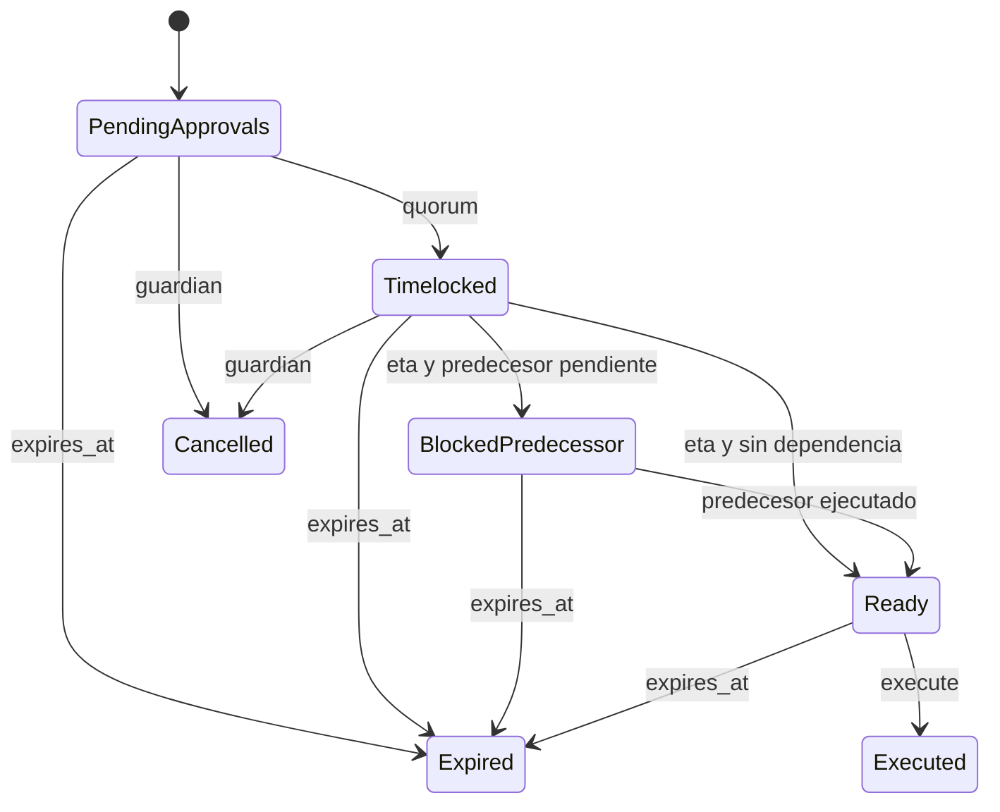
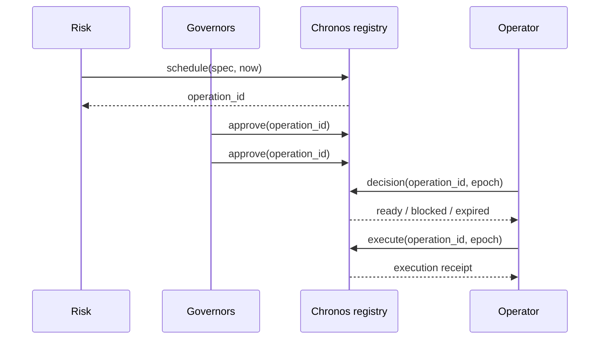

# Gobierno

## Modelo

`GovernanceRegistry` mantiene gobernadores activos, guardián, política y operaciones. Las aprobaciones se deduplican por `AccountId`; el guardián solo puede cancelar.

## Identidad

```text
domain = governance
subject = chronos-policy-operation-v1

fields = {
  protocol, network, chain_id, target, selector,
  payload_digest, predecessor, salt, eta, expires_at, quorum
}

operation_id = BLAKE3(canonical_envelope(fields))
```

Los campos se ordenan por clave y valor antes del hash. El digest final tiene 32 bytes y se representa con 64 caracteres hexadecimales.

## Política

- `quorum`: número mínimo de gobernadores distintos.
- `min_delay_epochs`: distancia mínima entre schedule y `eta`.
- `max_execution_window_epochs`: anchura máxima entre `eta` y expiración.

El quórum debe caber en el conjunto activo. Delay y ventana máxima son no nulos.

## Ciclo



La expiración se evalúa antes de quórum y timelock. Una operación expirada no vuelve a estar lista.

## Predecesores

Una operación dependiente solo se habilita si el registro contiene el digest predecesor con estado `Executed`. El identificador liga esa dependencia; sustituirla produce otra operación.



## Rotación

El registro no muta el conjunto de gobernadores durante una operación. La integración debe crear un nuevo registro o aplicar una migración gobernada, conservar el conjunto anterior para evidencia y evitar reinterpretar aprobaciones históricas.

## Evidencia

Conservar spec completa, envelope canónico, digest, aprobadores, epoch de schedule, decisión, receipt, payload efectivo y hash del release. El digest BLAKE3 identifica contenido; las firmas externas demuestran identidad.
