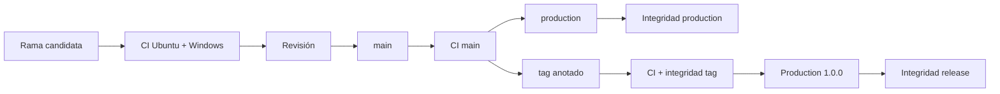

# Operaciones

## Promoción



La promoción solo termina cuando todas las referencias resuelven al mismo commit y el release no es draft ni prerelease.

## Host

- Proceso sin privilegios administrativos.
- Binario o servicio de solo lectura.
- Estado persistente con transacciones y control de concurrencia.
- TLS para tráfico remoto.
- Reloj de epochs supervisado y registrado.
- Secrets inyectados en runtime y fuera del repositorio.

## Apertura

1. Confirmar activo, pool y borrower.
2. Validar liquidez, utilización y límites de riesgo.
3. Fijar principal, colateral y maturity.
4. Registrar checkpoint de índices.
5. Reservar colateral antes de acreditar principal.
6. Archivar evento y snapshot.

## Lock

1. Cotizar en el epoch actual.
2. Verificar propietario, modo, release y operador.
3. Conservar snapshot previo.
4. Actualizar posición y registrar evento en la misma transacción.
5. No reutilizar una cotización después de avanzar epochs.

## Cierre

```text
read quote -> enforce max_total_due -> debit payer -> repay pool
           -> release collateral -> release active lock -> close position
           -> emit receipt
```

El receipt y el quote deben conservarse juntos.

## Señales

| Señal                          | Acción                         |
| ------------------------------ | ------------------------------ |
| utilización próxima al máximo  | limitar aperturas              |
| principal sin colateral        | detener pool y conciliar       |
| lock activo después de release | revisión operativa             |
| shortfall de estrés            | bloquear nueva capacidad       |
| HHI elevado                    | reducir límite por prestatario |
| operación no `Ready`           | no aplicar parámetros          |
| quote distinto del receipt     | detener cierres                |

## Recuperación

1. Congelar el pool afectado.
2. Conservar estado, epoch, eventos y hash de versión.
3. Reconstruir índices desde el último checkpoint confirmado.
4. Cotizar cada posición sin mutar.
5. Comparar pending charges, maturity y locks.
6. Ejecutar estrés con la política aprobada.
7. Preparar una operación temporal con expiración.
8. Probar sobre una copia de estado.
9. Reanudar tras doble aprobación y conciliación.

## Retención

Conservar requests, epochs, snapshots, journal, quotes, receipts, parámetros, operaciones de gobierno y hashes del release durante todo el periodo contractual y de conciliación. Un backup solo se considera válido después de restaurar y reproducir una secuencia conocida.

## Capacidad

La integración debe medir posiciones por pool, locks activos, eventos por epoch, tiempo de cálculo de estrés y tamaño de snapshots. Particionar por pool o periodo antes de que la reconstrucción exceda la ventana operativa.
