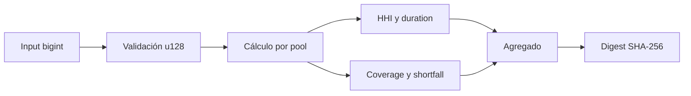

# SDK JavaScript

## Funciones

`sdk/chronosClient.js` incluye:

- `ChronosClient` para quote, lock, settlement y stress;
- `atomic` para normalizar `u128`;
- `computeTemporalStress` como modelo offline;
- `jsonBody` para serializar `bigint` como decimal.

## Cliente

```js
const { ChronosClient } = require("../sdk/chronosClient");

const client = new ChronosClient({
  baseUrl: "https://chronos.example",
  token: process.env.CHRONOS_TOKEN,
  timeoutMs: 10_000,
});
```

Fuera de `localhost`, `baseUrl` debe usar HTTPS. El cliente no sigue redirecciones, exige `application/json`, limita timeout y permite inyectar `fetch` para pruebas.

## Quotes

```js
const quote = await client.quotePosition("pos-42", 128n);
```

El epoch se envía como string decimal. La API debe devolver importes como strings para no perder precisión.

## Locks

```js
const lock = await client.createLock(
  {
    position: "pos-42",
    owner: "acct-7",
    releaseEpoch: 132n,
    mode: "rollover",
    reference: "rollover-2026-q3",
  },
  "lock:2026:00000042",
);
```

Las claves de idempotencia admiten 8..128 caracteres alfanuméricos y `._:-`.

## Settlement

```js
const receipt = await client.settlePosition(
  {
    position: "pos-42",
    payer: "acct-7",
    maxTotalDue: 2_000_000_000n,
  },
  "settlement:2026:00000042",
);
```

## Estrés offline



```js
const { computeTemporalStress } = require("../sdk/chronosClient");

const report = computeTemporalStress({
  generatedEpoch: 2n,
  pools: [
    {
      id: "pool-1",
      availableLiquidity: 200_000_000n,
      reserveBalance: 20_000_000n,
    },
  ],
  positions,
  policy,
});
```

El digest liga epoch, pool, gross claim, cobertura requerida y déficit. Sirve para correlación; no sustituye la firma del payload.

## Tipos

Los importes aceptan `bigint`, `number` entero seguro o string decimal canónico. El rango es `0..2¹²⁸-1`. Se rechazan negativos, decimales, exponentes, `NaN` e infinitos.

Los IDs siguen `[a-z][a-z0-9-]{0,62}`. El SDK valida forma; la API valida existencia y autorización.

## Errores

| Condición                     | Resultado                     |
| ----------------------------- | ----------------------------- |
| Input inválido                | `TypeError` antes de red      |
| Timeout                       | `AbortError` del transporte   |
| Content-Type distinto de JSON | `TypeError`                   |
| HTTP no exitoso               | `Error` con status y código   |
| Redirección                   | rechazo por `redirect: error` |

No registre tokens ni cuerpos completos si una integración añade datos sensibles.
