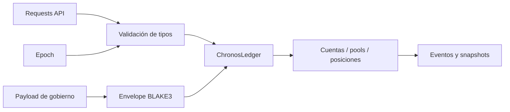
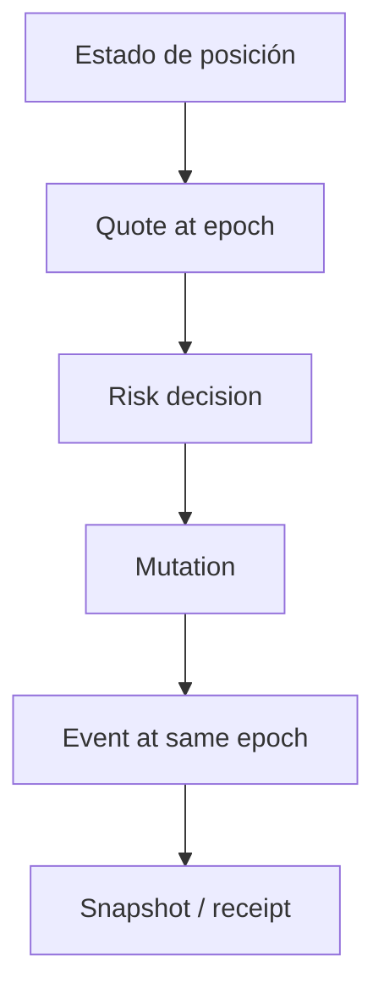

# Modelo de seguridad

## Propiedades

1. deuda y tiempo coherentes entre lectura y mutación;
2. colateral no liberado antes del cierre válido;
3. parámetros autorizados con dominio completo;
4. aritmética exacta y acotada;
5. evidencia ordenada y reproducible.

## Actores

| Actor           | Función                        | Separación                   |
| --------------- | ------------------------------ | ---------------------------- |
| Integrador      | autentica y construye requests | no controla índices internos |
| Fuente temporal | publica epoch autorizado       | no mueve fondos              |
| Gobernador      | aprueba parámetros             | no ejecuta posiciones        |
| Guardián        | cancela operaciones            | no aporta quórum por sí solo |
| Operador        | procesa locks y cierres        | no cambia payload aprobado   |
| Custodio        | conserva evidencia             | no reescribe estado          |

## Superficies

El SDK valida IDs, cantidades, HTTPS, JSON e idempotencia. El servidor debe volver a validar todos los campos; el SDK no es un límite de confianza.

## Aritmética

- `Amount`: `u128` con operaciones comprobadas.
- `Bps`: rango máximo explícito.
- `AccrualIndex`: escala `10¹²`.
- tasas y claims: multiplicación antes de división con detección de overflow.
- recursos: redondeo hacia abajo.
- obligaciones de estrés: redondeo hacia arriba.

## Controles temporales

El epoch usado para cotizar, decidir y mutar debe ser el mismo. Una integración no debe reutilizar quotes después de avanzar el reloj.

## Controles de gobierno

- Campos canónicos y acotados.
- Chain ID no nulo.
- Expiración posterior a `eta`.
- Delay mínimo y ventana máxima.
- Aprobadores únicos dentro del set activo.
- Predecesor ejecutado.
- Cancelación exclusiva del guardián.
- Ejecución única.

## Riesgos de integración

El crate no persiste estado entre procesos, no verifica firmas y no obtiene precios externos. El despliegue debe fijar:

- formato de firma y rotación;
- consenso sobre epoch;
- almacenamiento transaccional;
- control de concurrencia por posición;
- idempotencia de escrituras;
- calidad y vigencia de oráculos;
- retención de eventos y receipts.

## Controles del repositorio

- Rust 1.96 fijado.
- Build y tests `--locked`.
- Rustfmt y Clippy con warnings como error.
- Node 24 y Prettier fijado.
- CI Ubuntu y Windows.
- Verificador de documentación, banner, límites públicos y material privado.
- Integridad independiente de production, tag y release.

## Respuesta

La primera acción ante una divergencia económica es detener mutaciones del pool, preservar el primer estado discrepante y reproducirlo con el mismo commit y epoch. No se debe compensar manualmente antes de conciliar principal, índices, pending charges, locks y colateral.
